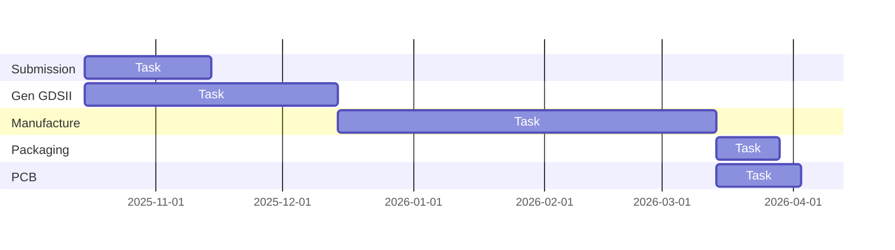

## ECOS Lab

<table>
<tr align="justify">
<td width="50%" valign="top">

### Basic Information
- **Create Date**: July, 2021
- **Members**: [Frontier System Laboratory, Center for Advanced Computer Systems, Institute of Computing Technology, Chinese Academy of Sciences](https://acs.ict.ac.cn/english), [Beijing Institute of Open Source Chip](https://www.bosc.ac.cn)
- **Partners**: [PengCheng Laboratory](https://www.pcl.ac.cn), [Shenzhen University of Advanced Technology](https://suat-sz.edu.cn/en), [Hong Kong University of Science and Technology (Guangzhou)](https://www.hkust-gz.edu.cn), etc
- **Slogan**: (Build an) **E**cosystem for **C**ollaborative and **O**pen **S**ilicon
- **Goal**: ECOS / ECOS Lab are committed to building open-source chip design solutions and its supporting technology ecosystem, using the concept of **"open source"** to innovate chip design methods, and realizing the ultimate vision of **"lowering the threshold of chip design with open source and empowering thousands of industries".**

### Community & Resources
TODO

</td>
<td width="50%" valign="top">

### Project List
- Talent Cultivation
  - [OSOC](https://ysyx.oscc.cc): Large-scale open public welfare chip and system talent training program
  - [MOLI](https://moli.oscc.cc): Massive Open Learning-by-doing Initiative
- RTL Design
  - **Open Source IP / SoC**: RISC-V processor, SoC framework / template, peripheral IP and computing IP
- EDA Tools
  - [iEDA](https://ieda.oscc.cc): Open source intelligent EDA tools and infrastructure, just like OpenRoad, etc
  - **Open Source EDA Toolchain**: Covers the core steps of chip design and supporting full-process design, just like OpenLane, SiliconCompiler, etc
- PDK Data
  - [ICSprout55 PDK](https://icsprout55-pdk.rtfd.io): 55nm CMOS Open Source PDK 
- Embedded
  - **Embedded Community**: Contains PCB board materials based on ECOS open source chip, click [here](https://embedded.ecoslab.com) to visit
- Platform & Service
  - **Cloud Platfrom**: Supports chip design & verification in the cloud as a service
  - **Design Service**: Provides low-cost tape-out services for universities and communities

</td>
</tr>
</table>

### Tapeout Shuttle
#### ICSprout55 MPW 1 (TBD)

Archive

  
#### ICSprout55 MPW 0
  

